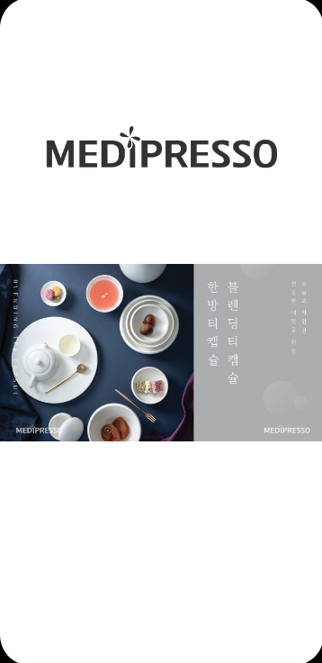
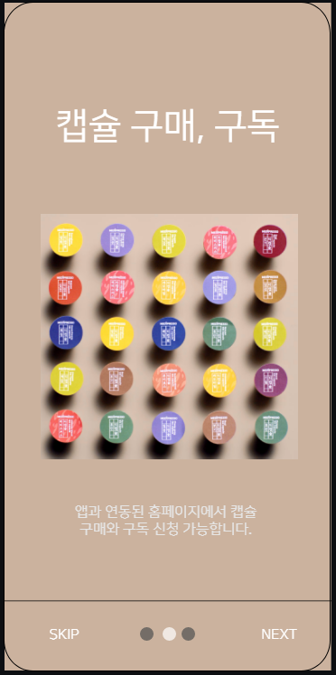
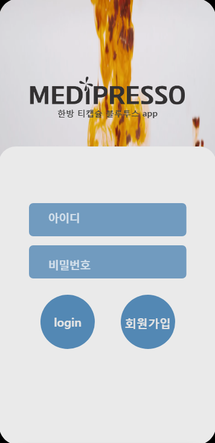
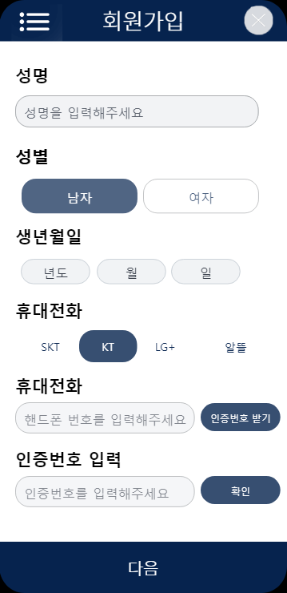
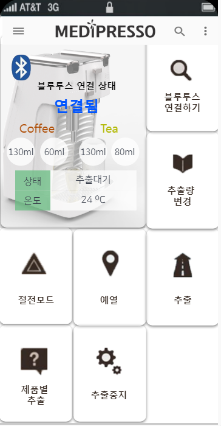
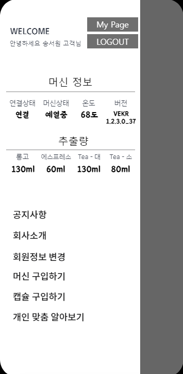
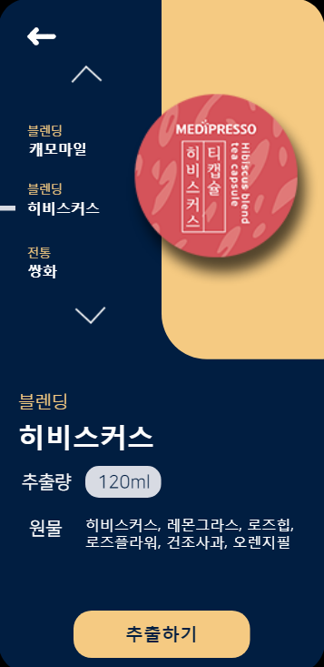
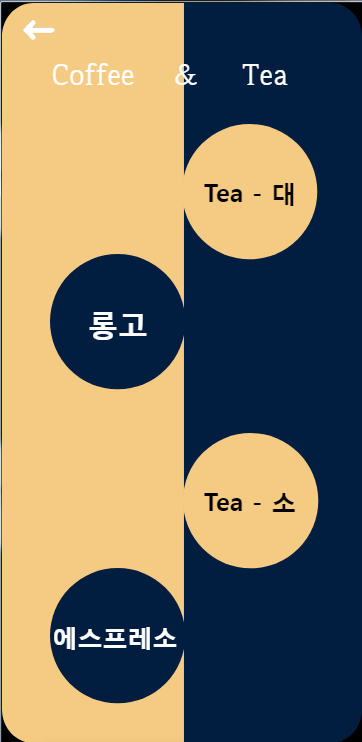

</img> 

***

# BLE센서와 통신하여 원격 조작 가능한 APP

 신규 머신에 들어있는 저전력 블루투스 센서와 연동하여 신규 머신을 조작하고 메디프레소 제품을 구매할 수 있도록 유도 향후 공식 APP이 될 수 있도록 업데이트 진행 예정

***

# 개발환경 
 * 안드로이드 스튜디오 

 * JSP
 
 * mysql

***

# APP 기능 및 설명에 대한 기획안

 * [APP기획안](https://github.com/2jooho/public_medi_BLE/blob/master/medipresso_app_plan.pdf)

***

# jsp서버 소스

 * [jsp소스](https://github.com/2jooho/public_medi_BLE/tree/server)

***

# APP 기능 소개

### `1. splash, onboard, 로그인, 회원가입`   
</img>
</img>
</img>
</img> 

### `2. 메인1, 메인2, drawer`   
</img>
</img>
</img> 

### `3. 제품별추출, 추출버튼`   
</img>
</img> 

***

# 코드 소개

* main_before   

스플레쉬화면, 온보더화면, 회원가입, 로그인 코드가 있음

* Main_page   

2개의 메인페이지와 드로어 부분 코드가 있으며, 프래그먼트와 어댑터 사용

* product_viewpager   

viewpager로 제품을 나열하고 클릭시 위로 올라가고 자사몰 연동되는 모션 코드가 있음

* BLE_connect   

머신과 연결하기 위한 소스로 list를 만들고 연결하여 리시브 및 서비스 등을 다루는 코드가 들어있음

* amount_change_viewpager   

제품별 추출량 변경 페이지를 소스가 들어있으며, list와 비동기로 jsp연동 등이 있음

